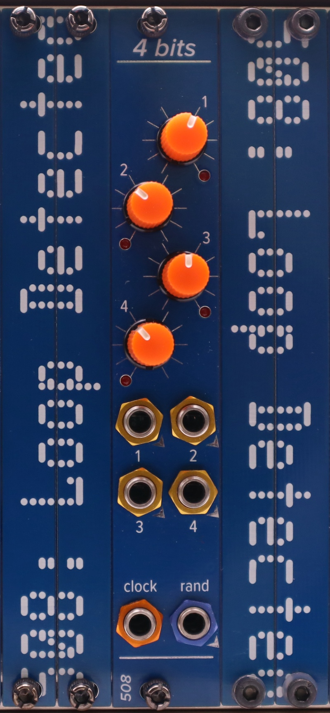

# 4 bits

Four random bits, plus your choice of noise or stepped random voltages.

This repository holds the files for the front panel and the i/o board. You will also need the files that are named something like `interpolating-seq-random-bits-no-ands-4hp-v2.2` from this project: https://github.com/508-loop-detected/interpolating-sequencer

The most human-readable BOMs are the ones with `fixed` in front of the name. The other BOMs are the ones generated by the EDA software. You can use them, the gerbers, and the pick-and-place files to order boards pre-populated with [some of] the SMD parts.

There are two trimmers for calibration. 

- VR1 controls the amplitude of the noise -- watch the noise output on a scope and adjust it until it's not brickwalling against the rails, and is around +/- 6V (12Vpp). 
- VR2 controls the offset -- watch the random bits output on a scope and adjust it until you're never dropping below zero, and are getting about as many bits close to 0V as you are close to 5V. All the steps should be between 0V and 5V, so if you're going over/under, adjust VR1 until you aren't, and then re-tweak VR2 until you're more or less centered around 2.5V.

This module, like many of my modules, uses 2mm-pitch male/female headers. Be sure you order/use the right thing!

Generally speaking, most ICs are SOIC 8/14/16, and all passives are 0805.
